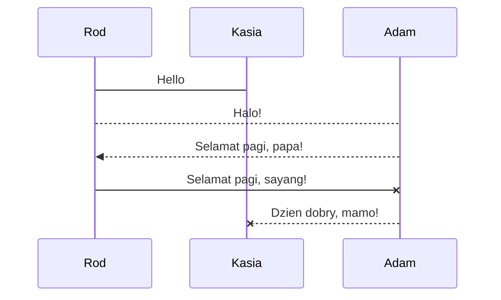
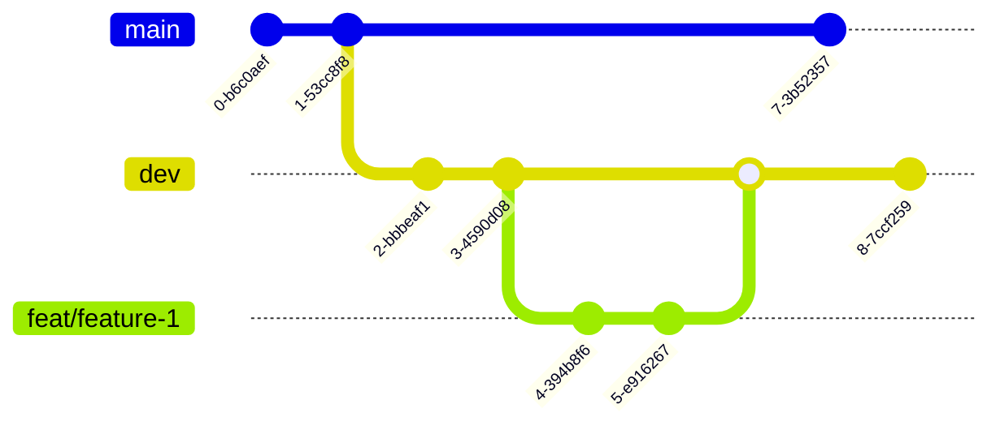
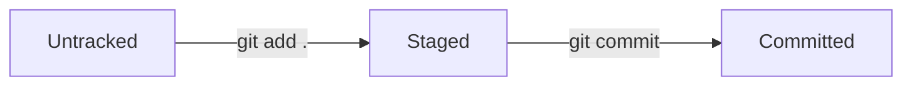

# Installation and Setup
## Installation
Follow official guide [here.](https://git-scm.com/book/en/v2/Getting-Started-Installing-Git)
## Setup
User configuration:

> **Note:** This is a note

```

This is code

```

`This is highlighted`





