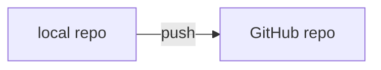
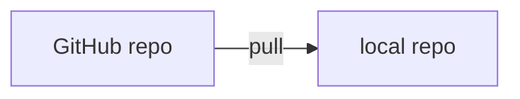
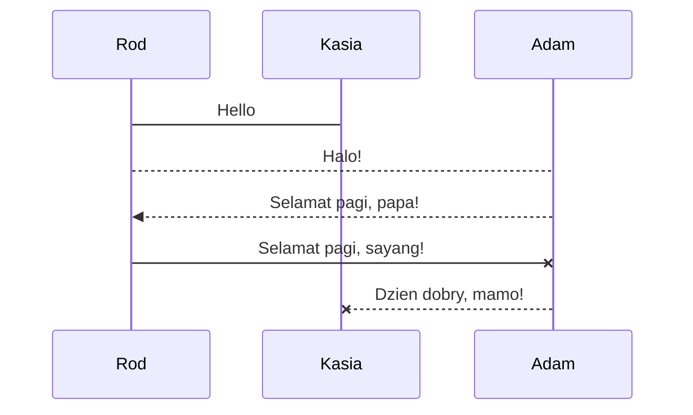
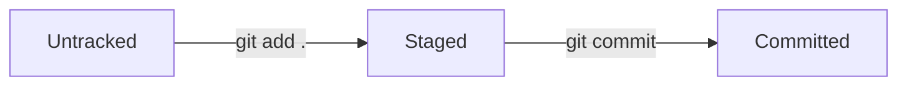

# Installation and Setup
## Local Setup
Based on your operating system, follow official guide [here.](https://git-scm.com/book/en/v2/Getting-Started-Installing-Git)
## Setup
To know the location of your git configuration file (.gitconfig):
```
git config --list --show-origin
```
To edit your git configuration using Visual Code (arbitrary), enter the full path into the command below. E.g. ~/.config is the path:
```
code ~/.gitconfig
```
Alternatively, you can modify .gitconfig file via CLI if you know the elements to set. E.g. to change username and email address:
```
git config --global user.name "Rod Taylor"
git config --global user.email "git-master@mail.com"
```
To initialise a local repository, type the command below in the repository folder. This will create a hidden .git folder inside the repo:
```
git init
```

## Remote Setup
Remote here means GitHub repository that is linked/referenced by your local repo.
Your remote repo can exist before you create your local (see work flow #1), or after you create your local (see work flow #2).


Once you initialise a local git repository, check if that repo linked to any remote repo:
```
git remote -v
```
> **-v:** verbose

Remote reference is named, by default, to `origin`. Use command below to rename. E.g. from `origin` to `main`:
```
git remote -rename origin main
```

[return to Contents](https://github.com/rtaylor02/git-master/blob/main/README.md)

# My Scratch Pad
> **Note:** This is a note

```

3 back-ticks: This is code

```

`This is highlighted`





